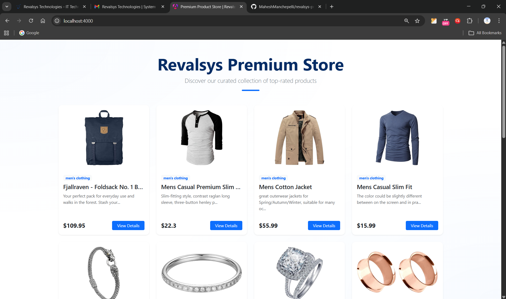
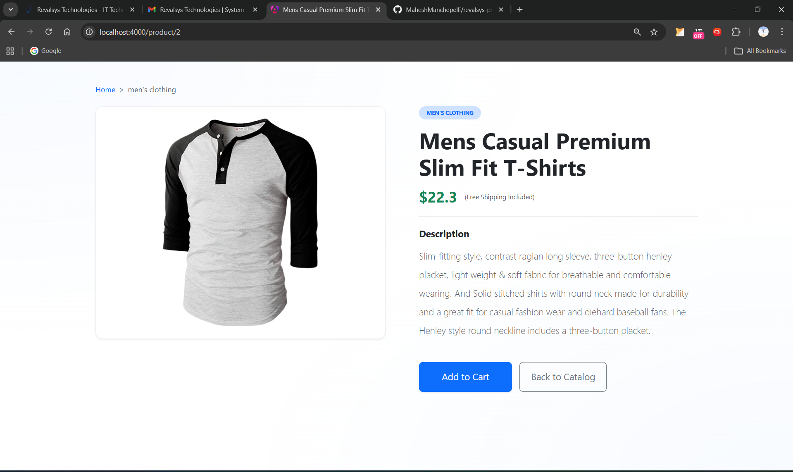
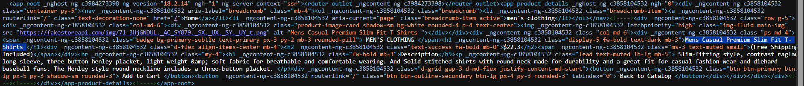
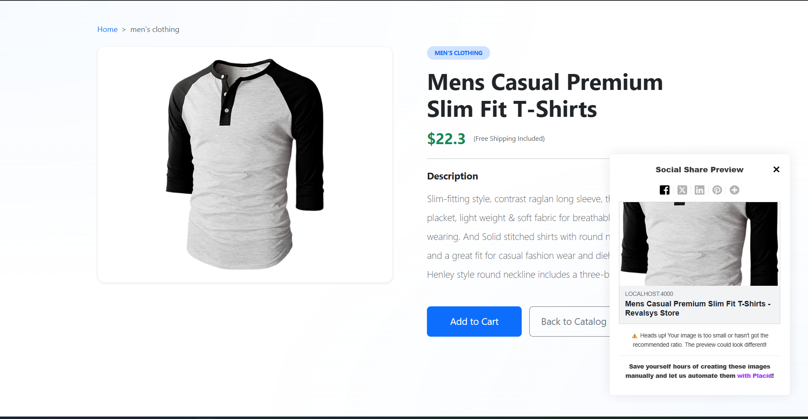

# Revalsys Product Store (Angular 18 SSR)

A high-performance e-commerce catalog showcasing **Angular 18** features, **Server-Side Rendering (SSR)**, and **Signals**.

## Key Features & Architecture

### 1. Server-Side Rendering (SSR)
- Fully SEO-compliant using `@angular/ssr`.
- Dynamic metadata (Title, Description, Open Graph) updated per product via a centralized `SeoService`.
- **Hydration:** Optimized with `provideClientHydration()` to prevent UI flickering.

### 2. Modern Angular Patterns
- **Signals:** Used `signal`, `computed`, and `effect` for reactive state management.
- **Control Flow:** Utilized `@for`, `@if`, and `@defer` for modern, readable templates.
- **@defer Blocks:** Implemented for listing cards to improve Initial Page Load speed.

### 3. Styling & UI
- **Bootstrap 5:** Responsive grid system.
- **SCSS Variables:** Centralized theme management in `_variables.scss`.

---

## Installation & Commands

# Install dependencies
npm install

# Run development server
npm run dev

# Build and Test SSR
npm run build

npm run serve:ssr:revalsys-products-task

📂 Project Structure
src/app/core: Shared services (SEO, Product) and models.

src/app/features: Domain-specific components (Listing, Detail).

src/styles: Theme and global styling.

---

## 📸 Screenshots

### Product Listing

### Product Detail View

### SSR & SEO Validation
*The screenshot below shows the page source rendered by the server, including dynamic Meta Tags for SEO.*

